<!--### Hi there 👋-->

<!--
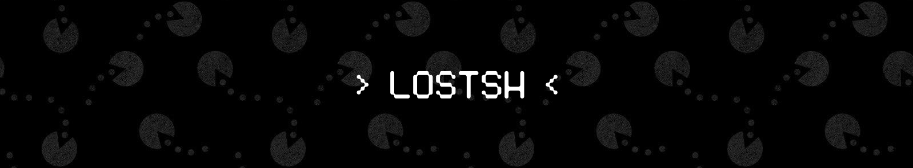


-->

<!--
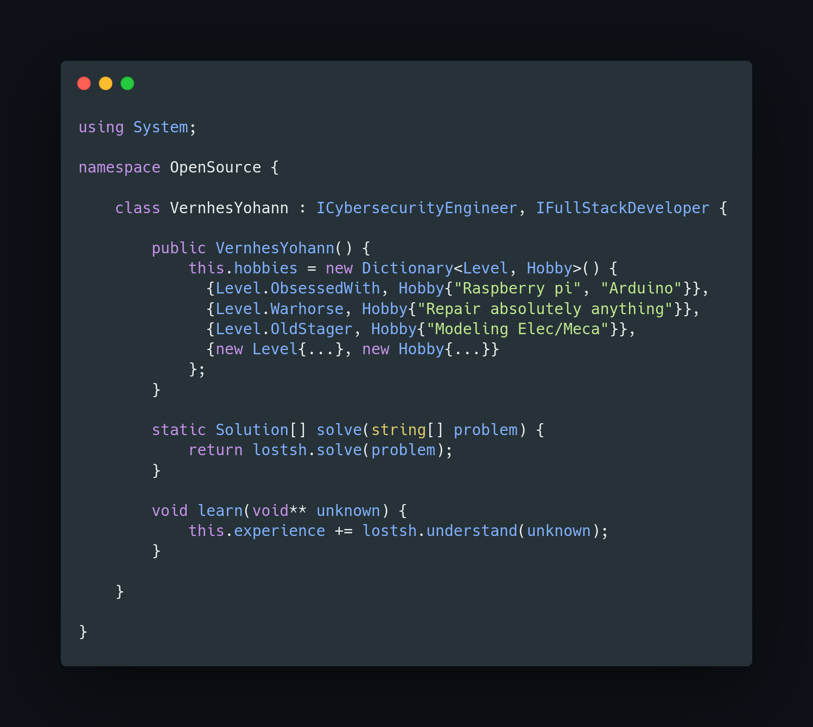
-->

```csharp
using System;

namespace OpenSource {
    class VernhesYohann : ICybersecurityEngineer, IFullStackDeveloper {
        public VernhesYohann() {
            this.hobbies = new Dictionary<Level, Hobby>() {
                {Level.ObsessedWith, Hobby{"Raspberry pi", "Arduino"}},
                {Level.Warhorse, Hobby{"Repair absolutely anything"}},
                {Level.OldStager, Hobby{"Modeling Elec/Meca"}},
                {new Level{...}, new Hobby{...}}
            };
        }
        
        static Solution[] solve(string[] problem) {
            return lostsh.solve(problem);
        }
        
        void learn(void** unknown) {
            this.experience += lostsh.understand(unknown);
        }
    }
}
```

#### Small quick propaganda :

<table border=1 align="left">
<tr><td>Cybersecurity <br>Management</td><td>
  <br>  <br>
</td></tr>
<tr><td>OffSec</td><td>
  <br>    <br>  
</td></tr>
<tr><td>Digital <br>investigation</td><td>
 <br>  <br>
</td></tr>
<tr><td>Infrastructure <br>& Network</td><td>
   
</td></tr>
</table>

<a title="Checkout some data leak" href="https://lostsh.github.io"></a>

<br>&nbsp;<br>
<br><br><br><br><br><br><br><br>
<br><br><br><br>

<hr>

          


<hr>


<!--
- 🔭 Professional problem solver with a developer degree
- 👯 Engineer made in CY-Tech (ex EISTI) 
- 🌱 Passionate about learning new things
-->

<!--
## About me
📝 I am a student in last year of computer engineering school.<br>
💾 I have been passionate about computers for a long time, before knowing how to program I learned to repair 🛠️, assemble and install computers 🖥️, then came the code 👨‍💻 , and I really love it all 🫀.

I like computer projects, I am a big fan of **Raspberry pi** since the release of the 1B + model moreover I also particularly like **Aduino**
-->


<!--

#### Mostly talk
- [x] C99 - 98
- [x] Cpp / ino
- [x] Java (SE / EE + FX)
- [x] JS/HTML/CSS
- [x] PHP
- [x] Python (1.7/2.1/2.7/3)
- [x] Assembly
- [x] Bash
- [x] C# (OLEBD, LINQ, WINFORMS)
- [x] Go

-->

<!--
```bash
╔═════════════════════════════╗
║  █████╗ █╗ █████╗ █████╗ █╗ ║
║  █╔═══╝ █║ █╔═══╝ ╚═█╔═╝ █║ ║
║  ███╗   █║ █████╗   █║   █║ ║
║  █╔═╝   █║ ╚═══█║   █║   █║ ║
║  █████╗ █║ █████║   █║   █║ ║
║  ╚════╝ ╚╝ ╚════╝   ╚╝   ╚╝ ║
╚═════════════════════════════╝

┌─────────────────────────────┐
│  ╔═════════╗     ┏┅┅┅┅┅┅┓   │▒
│  ║ MORPION ║     ┇ GAME ┇   │▒
│  ╚════╦════╝     ┗┅┅┅┅┅┅┛   │▒
╞═╤═════╩═════╤═══════════════╡▒
│ ├───┬───┬───┤               │▒
│ │ X │   │ O │   ╭╴      ╶╮  │▒
│ ├───┼───┼───┤   │   BY   │  │▒
│ │   │ X │ O │   │        │  │▒
│ ├───┼───┼───┤   │ LOSTSH │  │▒
│ │   │   │ X │   ╰╴      ╶╯  │▒
│ └───┴───┴───┘               │▒
└─────────────────────────────┘▒
 ▒▒▒▒▒▒▒▒▒▒▒▒▒▒▒▒▒▒▒▒▒▒▒▒▒▒▒▒▒▒▒

```
-->


## Some fun projects

|Borne d'arcade|Sunny|OpenBoat|
|--------------|--------------|--------------|
||[Sunny project website](https://lostsh.github.io/sunny/)|[OpenBoat GitHub repo](https://github.com/lostsh/openBoat)|
|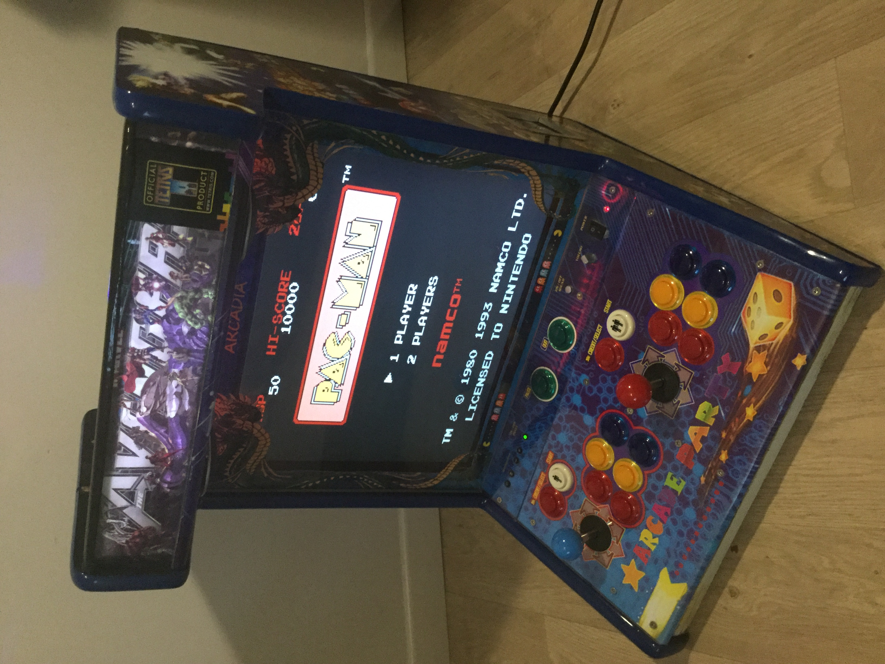|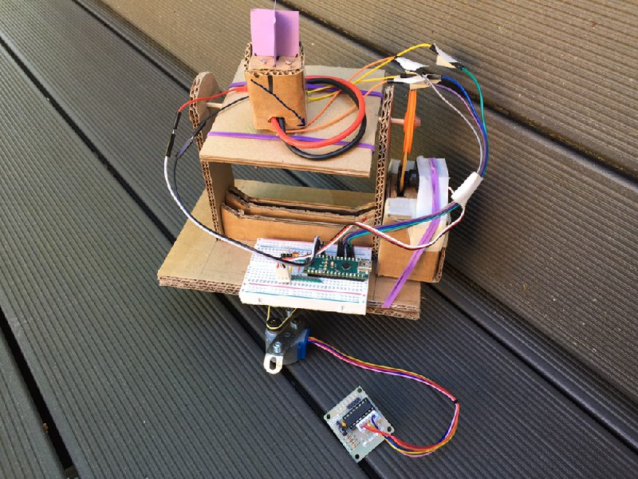|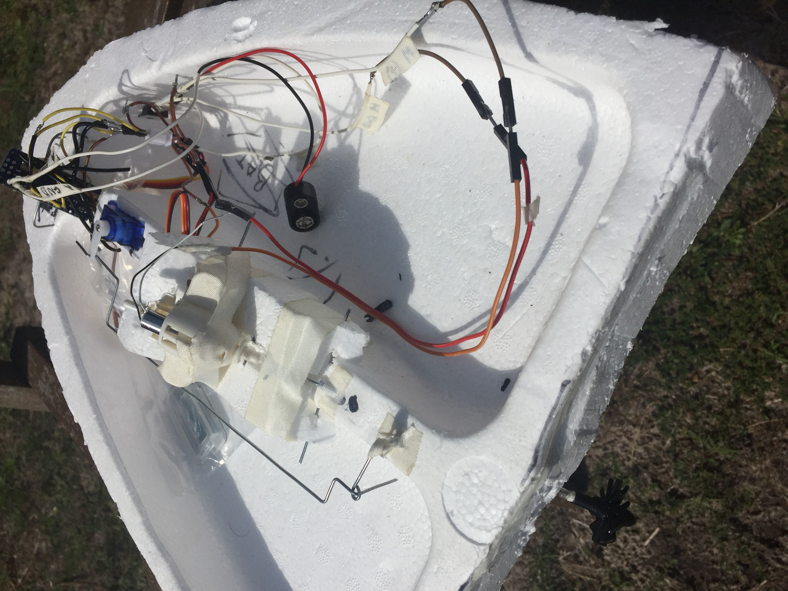|
|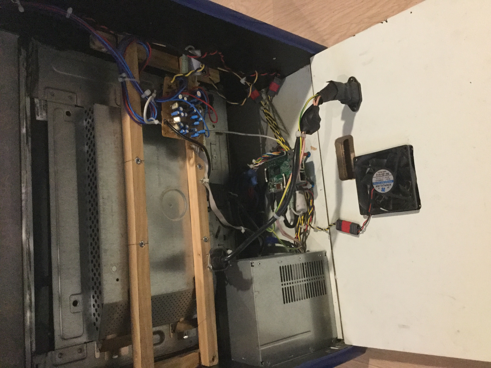|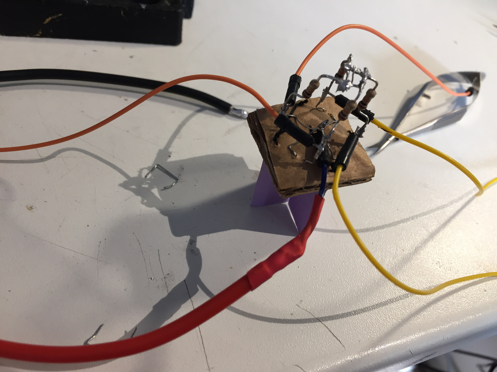|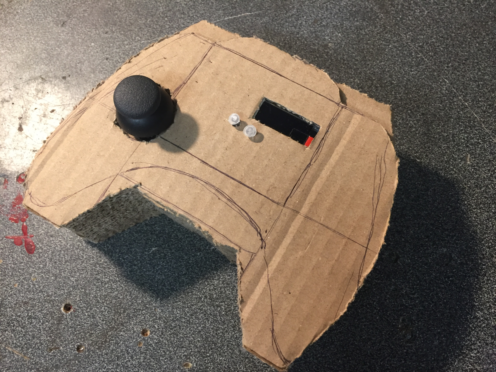|
|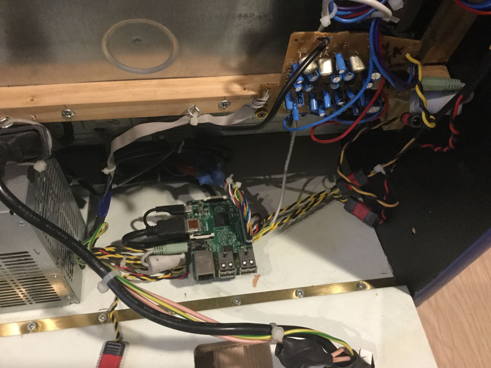|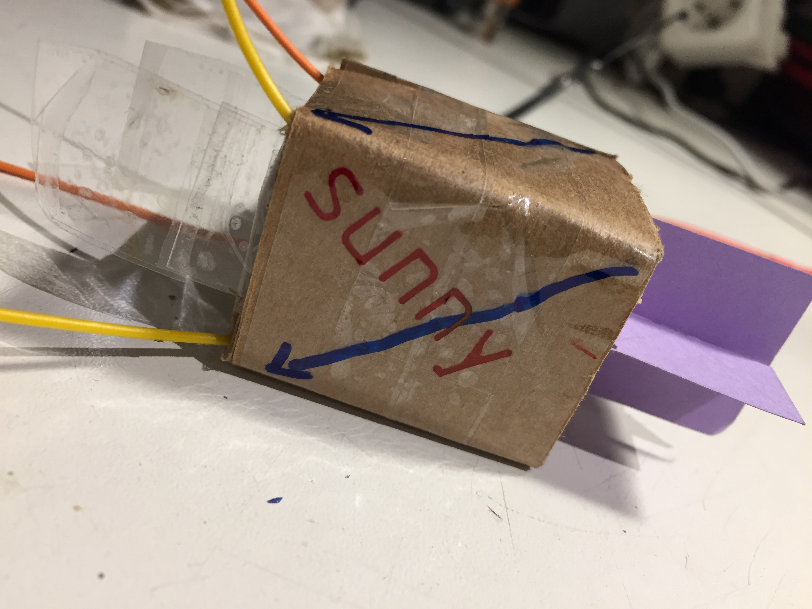|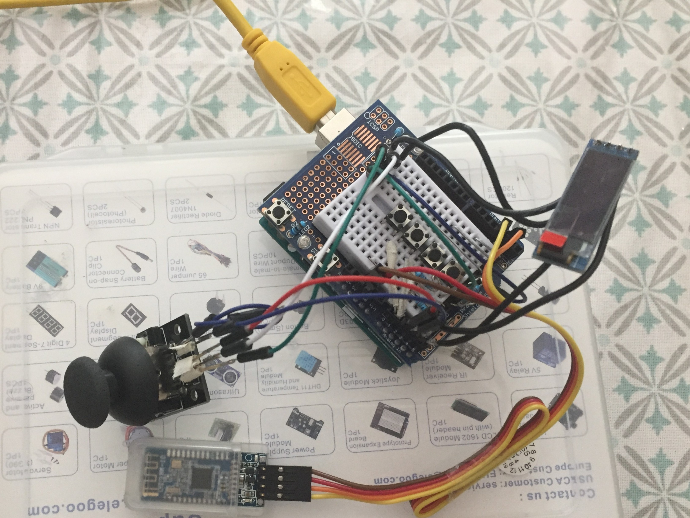|
|In 2016 I built my arcade machine, on which I love to play Pac-Man|Sunny is a solar tracker project|This is a good example of a handmade motor controller, plus I had to create my own bluetooth remote control, it works surprisingly well|

<!--
**lostsh/lostsh** is a ✨ _special_ ✨ repository because its `README.md` [](this file) appears on your GitHub profile.

Here are some ideas to get you started:

- 🔭 I’m currently working on ...
- 🌱 I’m currently learning ...
- 👯 I’m looking to collaborate on ...
- 🤔 I’m looking for help with ...
- 💬 Ask me about ...
- 📫 How to reach me: ...
- 😄 Pronouns: ...
- ⚡ Fun fact: ...
-->

## Fun stats


<!--

-->

<!--


-->


## Completion of some projects

```bash
Perso Blog        ███████░░░░░░░░░░░░░░░░░░░░░░░    32%

Morpion           ██████████████████████████░░░░    87%

Sunny             █████████████████████████████░    97%
```

```bash
OpenBoat          ████████████████████░░░░░░░░░░    70%

Mail Client       ██████████████████░░░░░░░░░░░░    57%

Blog Editor JFX   ██████████░░░░░░░░░░░░░░░░░░░░    44%

SDL - Lib         ████░░░░░░░░░░░░░░░░░░░░░░░░░░    13%
```


<!--

```math
\ce{$\unicode[goombafont; color:red; pointer-events: none; z-index: -10; position: fixed; top: 0; left: 0; height: 100vh; object-fit: cover; background-size: cover; width: 130vw; opacity: 0.1; background: url('https://github.com/lostsh/lostsh/assets/43549864/76ebbdd1-c97c-4f97-b17f-7f35316c4681');]{x0000}$}

-->
